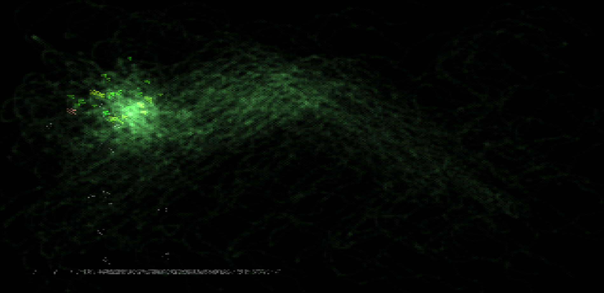
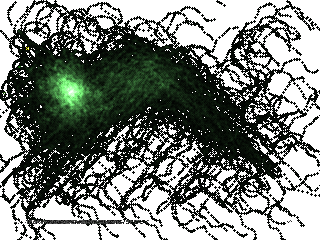

Dumb Fly Simulator.
Up to you to guess what this program does (or doesn't).
Cheers.
Test @ https://flysim.iskarion.ddns.net


# Fly-SimulatorCells


## Project Description
This is a Fly Simulator. It simulates flies, fighting for food, then their violent behavior causes them to perish and get stingished.\

There is not much to add, its a good screensaver, as long as you press F5 when all flies die.

Live Demo: https://flysim.iskarion.ddns.net/



## Install / Deploy Instructions
 1. Clone Repository
    ```bash
    git clone git@github.com:pinakure/Fly-Simulator.git /src/flysim
    ```
 2. Get up the container
    ```bash
    cd /src/flysim
    docker compose up --build -d
    ```

## Generating Random Pixelart
The flies will leave a trail everywhere they go. Leave them moving around a while, then right-click the screen and select **'Save picture as'** to download a nice random pixelart.



